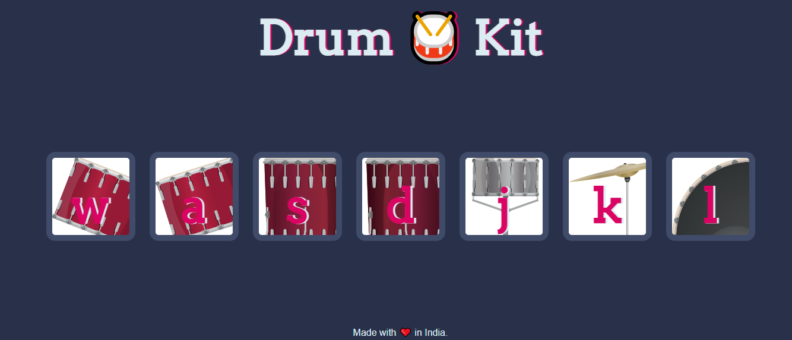

# Drum-Kit

### Table of Contents

- [Description](#description)
- [Technologies](#technologies)
- [How To Use](#how-to-use)
- [License](#license)
- [Author](#author)

---

## Description
Hello, this is a Drum kit app, which makes sound of the drum and other instruments according to the picture shows and overall you can create various sounds which can be soothing to ear and can be fun. 

#### Technologies

- Html
- CSS
- Javasrcipt

[Back To The Top](#read-me-template)

## How To Use

#### Installation

First download the project using zip file then open it in any code editor you want like vscode, atom.
And then right click and open it with live server option

and bingo My project is ready to serve.

[Back To The Top](#read-me-template)

## License

Copyright (c) [2021] [Shweta Mehta]

Permission is hereby granted, free of charge, to any person obtaining a copy
of this software and associated documentation files (the "Software"), to deal
in the Software without restriction, including without limitation the rights
to use, copy, modify, merge, publish, distribute, sublicense, and/or sell
copies of the Software, and to permit persons to whom the Software is
furnished to do so, subject to the following conditions:

The above copyright notice and this permission notice shall be included in all
copies or substantial portions of the Software.

## Author 
- - [Shweta mehta](https://github.com/shweta588)
